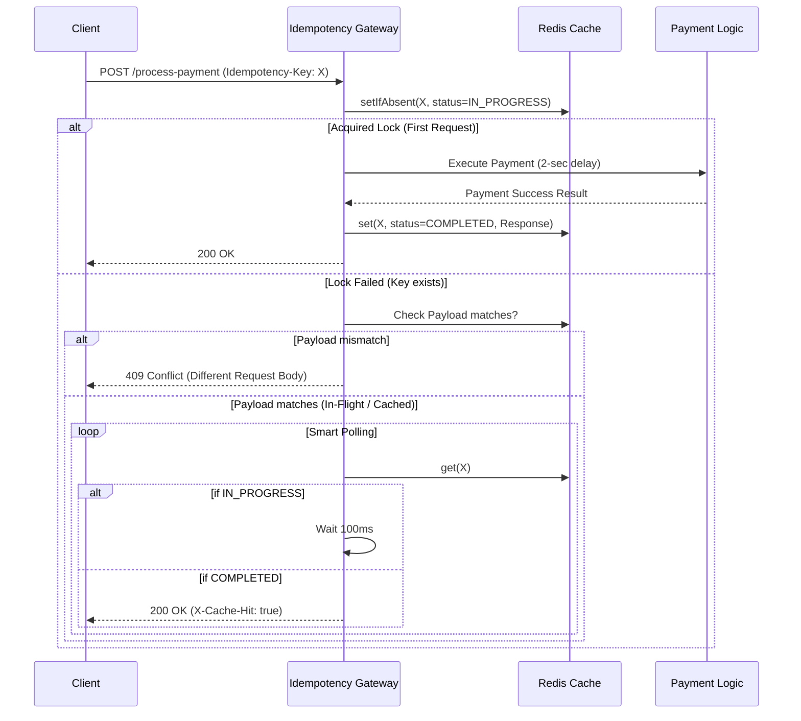

# Idempotency-Gateway (The "Pay-Once" Protocol) 🚀

A robust, highly scalable REST API middleware for FinSafe that ensures payment requests are processed exactly once, solving the critical issue of double-charging customers due to network timeouts. 

This upgraded iteration is built entirely on **Redis**, transforming the architecture from a single-node in-memory application to a highly available, horizontally scalable distributed system!

## 🏗️ Architecture Design (Redis Migration)

The application uses Redis as the centralized source of truth for idempotency and concurrency locks.



## ✨ The "Extraordinary" Developer's Choice Challenge

### Feature: Distributed Fixed-Window Rate Limiter
**Why?** In a real-world Fintech ecosystem, you must protect your underlying payment processor from DDoS attacks, runaway client scripts, or malicious actors. A simple gateway without rate limiting is a sitting duck.

**Implementation**: I built a highly-performant **Rate Limiter** natively using Redis intercepts. It restricts clients to a maximum of `100 requests per minute` based on their Client IP. If they exceed the limit, the Gateway intercepts the request at the very edge, immediately returning a `429 Too Many Requests` response before any heavy payload validation, idempotency checks, or payment logic are even executed. 

## 🌟 The Bonus Story: In-Flight Check (Race Conditions)
If `Request A` and `Request B` arrive simultaneously with the same `Idempotency-Key`:
The atomic Redis `setIfAbsent` (SETNX) guarantees only one request becomes the "processor". The second request fails to acquire the lock and elegantly enters a **Smart Polling Loop**. It checks Redis every 100 milliseconds to see if the state has transitioned from `IN_PROGRESS` to `COMPLETED`. Once completed, it intercepts the cached response and returns it without executing the payment logic twice.

---

## 🛠️ Tech Stack
- **Java 17** ☕ (LTS stability)
- **Spring Boot 3.x** 🌱 (Web, Validation, Actuator)
- **Redis** 🐘 (Distributed Locking, State, Rate Limiting)
- **Gradle** 🐘
- **Docker Compose** 🐳 (Local dev environment)
- **Render** ☁️ (Cloud deployment)

---

## 🚀 Setup & Run Instructions

### Prerequisites
- Docker & Docker Compose

### Running Locally (The Best Way)
```bash
docker-compose up --build
```
This single command spins up both the **Redis** container and the **Gateway Application**. The server will be available at `http://localhost:8080`.

---

## 📖 API Documentation

### `POST /process-payment`

Processes a payment safely exactly once.

**Headers:**
| Header | Type | Description | Required |
| --- | --- | --- | --- |
| `Idempotency-Key` | `String` | Unique UUID or Hash | ✅ Yes |
| `Content-Type` | `String` | `application/json` | ✅ Yes |

**Request Body:**
```json
{
  "amount": 150.50,
  "currency": "GHS"
}
```

#### Example Scenarios:

**1. First Request (Happy Path)**
```bash
curl -X POST http://localhost:8080/process-payment \
-H "Idempotency-Key: abc-123" \
-H "Content-Type: application/json" \
-d '{"amount": 100, "currency": "GHS"}'
```
*Response: 200 OK (After 2 seconds)*
```json
{
  "status": "Charged 100 GHS"
}
```

**2. Duplicate Request (Same Payload)**
```bash
curl -i -X POST http://localhost:8080/process-payment \
-H "Idempotency-Key: abc-123" \
-H "Content-Type: application/json" \
-d '{"amount": 100, "currency": "GHS"}'
```
*Response: 200 OK (Instantaneous)*
```http
X-Cache-Hit: true

{
  "status": "Charged 100 GHS"
}
```

**3. Conflict / Fraud Check (Different Payload)**
```bash
curl -X POST http://localhost:8080/process-payment \
-H "Idempotency-Key: abc-123" \
-H "Content-Type: application/json" \
-d '{"amount": 500, "currency": "GHS"}'
```
*Response: 409 Conflict*
```json
{
  "status": 409,
  "error": "Conflict",
  "message": "Idempotency key already used for a different request body."
}
```

**4. Rate Limiting Check (DDoS Protection)**
If you spam the endpoint > 100 times in a minute:
*Response: 429 Too Many Requests*
```http
HTTP/1.1 429 Too Many Requests
Too Many Requests - Rate Limit Exceeded
```
