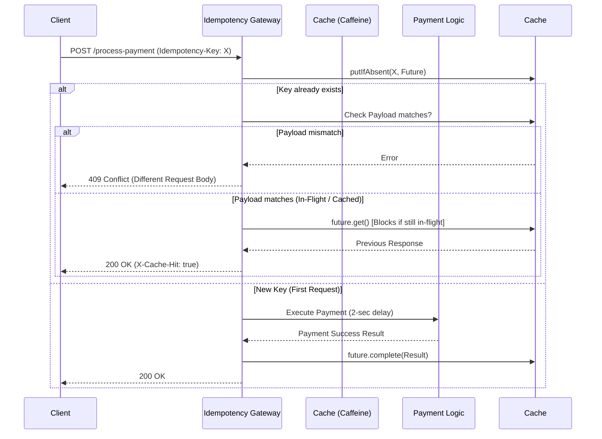

# Idempotency-Gateway (The "Pay-Once" Protocol) 🚀

A robust, production-ready REST API middleware for FinSafe that ensures payment requests are processed exactly once, solving the critical issue of double-charging customers due to network timeouts.

## 🏗️ Architecture Design

The application serves as a gateway to intercept payment requests, validate idempotency keys, and elegantly handle race conditions (in-flight identical requests) using concurrent cache structures natively.



## ✨ The Developer's Choice Challenge

### Feature: Cache TTL (Time-To-Live) and Eviction Strategy
**Why?** In a real-world Fintech system, storing millions of idempotency keys in memory indefinitely will inevitably lead to an `OutOfMemoryError`. 

**Implementation**: I used **Caffeine Cache**, a high-performance Java caching library. It natively supports atomic operations (to solve the race-condition Bonus Story) and provides an eviction strategy. The cache is configured with:
- `expireAfterWrite(24, TimeUnit.HOURS)`: Idempotency keys expire after 24 hours, keeping memory footprint lean.
- `maximumSize(100_000)`: A hard cap to ensure safety during sudden traffic spikes.

## 🌟 The Bonus Story: In-Flight Check (Race Conditions)
If `Request A` and `Request B` arrive simultaneously with the same `Idempotency-Key`:
The system stores a wrapper object containing a `CompletableFuture`. The atomic `putIfAbsent` operation guarantees only the first request initializes the payment processing thread. The second request gracefully hits `future.get()` and waits (blocks) until the first request completes, returning identical data to both without executing the payment twice.

---

## 🛠️ Tech Stack
- **Java 17** ☕ (LTS stability)
- **Spring Boot 3.x** 🌱 (Web, Validation, Actuator)
- **Gradle** 🐘
- **Caffeine Cache** ☕ (High performance in-memory caching)
- **Docker** 🐳 (Multi-stage build for Render deployment)

---

## 🚀 Setup & Run Instructions

### Prerequisites
- JDK 17
- Docker (optional)

### Running Locally (Gradle)
```bash
./gradlew bootRun
```

### Running with Docker (Production Ready)
```bash
docker build -t idempotency-gateway .
docker run -p 8080:8080 idempotency-gateway
```

The server will be available at `http://localhost:8080`

---

## 📖 API Documentation

### `POST /process-payment`

Processes a payment safely exactly once.

**Headers:**
| Header | Type | Description | Required |
| --- | --- | --- | --- |
| `Idempotency-Key` | `String` | Unique UUID or Hash | ✅ Yes |
| `Content-Type` | `String` | `application/json` | ✅ Yes |

**Request Body:**
```json
{
  "amount": 150.50,
  "currency": "GHS"
}
```

#### Example Scenarios:

**1. First Request (Happy Path)**
```bash
curl -X POST http://localhost:8080/process-payment \
-H "Idempotency-Key: abc-123" \
-H "Content-Type: application/json" \
-d '{"amount": 100, "currency": "GHS"}'
```
*Response: 200 OK (After 2 seconds)*
```json
{
  "status": "Charged 100 GHS"
}
```

**2. Duplicate Request (Same Payload)**
```bash
curl -i -X POST http://localhost:8080/process-payment \
-H "Idempotency-Key: abc-123" \
-H "Content-Type: application/json" \
-d '{"amount": 100, "currency": "GHS"}'
```
*Response: 200 OK (Instantaneous)*
```http
X-Cache-Hit: true

{
  "status": "Charged 100 GHS"
}
```

**3. Conflict / Fraud Check (Different Payload)**
```bash
curl -X POST http://localhost:8080/process-payment \
-H "Idempotency-Key: abc-123" \
-H "Content-Type: application/json" \
-d '{"amount": 500, "currency": "GHS"}'
```
*Response: 409 Conflict*
```json
{
  "status": 409,
  "error": "Conflict",
  "message": "Idempotency key already used for a different request body."
}
```
